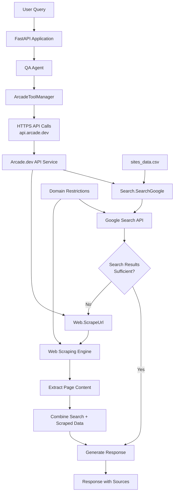

# Domain-Specific Q&A Agent: RAG alternative using Arcade.dev API

**This project showcases the simplest approach to building documentation Q&A systems** - demonstrating how arcade.dev's API eliminates both RAG complexity AND the need to manage your own search/scraping infrastructure with enhanced security over MCP.

> **🔄 Temporary Security Enhancement**: This version uses arcade.dev's direct API **temporarily** to address current MCP authentication limitations. While MCP represents the superior standardized approach for AI tool integration, it currently lacks enterprise-grade authentication. Arcade.dev is actively working on MCP protocol support with proper authentication - **this will be the recommended approach once available** as standards are crucial for long-term maintainability and ecosystem compatibility.

## 🔄 Project Evolution

This is the **fourth project** in a series exploring AI agent architectures:

1. **[Original Search-First Agent](https://github.com/javiramos1/qagent)** - Proved RAG is often overkill by using direct search APIs with LangChain local tools
2. **[Custom MCP Server Agent](https://github.com/javiramos1/qagent-mcp)** - Enhanced with Model Context Protocol, separating tools into external MCP server process  
3. **[Arcade.dev MCP Agent](https://github.com/javiramos1/qagent-mcp-tools)** - Ultimate simplification using arcade.dev's managed MCP service
4. **[Arcade.dev API Agent](https://github.com/javiramos1/qagent-mcp-tools-arcade)** - **This project** - Temporary security enhancement using arcade.dev's API directly (non-standard approach)

Instead of using MCP protocol, this version uses arcade.dev's API directly through the `langchain-arcade` package. **This is a temporary approach** to address current MCP authentication limitations while maintaining security benefits. **MCP remains the preferred long-term solution** due to its standardized approach, and arcade.dev plans to support it with proper authentication soon.

> **📚 For detailed analysis of why search-first approaches beat RAG in 2025** (cost comparisons, performance advantages, model selection strategies), see the [original project documentation](https://github.com/javiramos1/qagent#-why-search-first-beats-rag-in-2025).

## 🆕 What's New with Arcade.dev API (Temporary Approach)

This version uses **arcade.dev's API directly** as a **temporary security enhancement** while awaiting MCP authentication support:

- **🔐 Current Security Benefit**: Direct API authentication addresses MCP's authentication gap
- **⚠️ Non-Standard Approach**: Bypasses MCP protocol standardization (temporary trade-off)
- **🔄 Migration Path**: Will transition back to MCP once arcade.dev implements authentication
- **🛠️ Pre-built Tools**: Search and scraping capabilities provided out-of-the-box
- **🔑 Single API Key**: Only need arcade.dev API key (no SerpAPI, Firecrawl, etc.)
- **📡 Direct Integration**: Use `langchain-arcade` for API access (temporary non-MCP approach)
- **🐳 Simplified Deployment**: Single-service Docker setup

**Important**: This approach prioritizes **security over standardization** as a temporary measure. MCP protocol support with authentication will be the recommended long-term solution.

## 🚀 Key Features

- **🎯 Smart Tool Selection**: Automatically chooses between fast search and comprehensive scraping based on query needs
- **🔍 Domain-Restricted Search**: Only searches approved organizational documentation websites
- **🧠 Web Scraping Fallback**: Comprehensive page scraping when search results are insufficient  
- **⚡ Arcade.dev API**: Use arcade.dev's tools directly via their API with enhanced security
- **🔗 LangChain Integration**: Seamless integration through `langchain-arcade` package
- **🚀 Zero Infrastructure**: No need to deploy or manage your own tool servers
- **💰 Cost-Competitive**: At $0.005-$0.075 per query, often cheaper than traditional RAG systems
- **⚡ Performance Optimized**: Fast search for 90% of queries, deep scraping only when needed
- **🛡️ Data Security**: No sensitive data sent to vector databases or training systems
- **📊 Transparent Sources**: Every answer includes clear source attribution from official documentation
- **🔧 Easy Configuration**: Simple CSV file controls which knowledge sources are accessible
- **💬 Conversation Memory**: Maintains context across multiple questions in a session
- **🎮 Production Ready**: FastAPI backend with proper error handling and logging

## 🤔 Understanding MCP and Arcade.dev

### Model Context Protocol (MCP)

The [Model Context Protocol](https://modelcontextprotocol.io/) represents a fundamental shift in how AI models interact with external tools and APIs. At its core, MCP addresses the growing complexity and security challenges in AI tool integration, providing a standardized way for models to access and utilize external capabilities safely and efficiently.

#### Why MCP?

Traditional AI tool integration faces three major challenges that MCP solves elegantly:

**Integration Complexity**: Before MCP, each tool required its own integration code, leading to maintenance overhead and potential security vulnerabilities. MCP introduces a unified interface that reduces integration code by up to 80%, allowing developers to focus on tool functionality rather than implementation details.

**Security Management**: The traditional approach of directly connecting AI models to external APIs exposes sensitive credentials and increases attack surface. MCP's managed execution environment completely eliminates credential exposure by handling all security aspects within its isolated environment.

**Scaling Challenges**: As AI applications grow, managing rate limits and scaling individual tools becomes increasingly complex. MCP provides centralized rate limiting and intelligent queue management, ensuring reliable performance even under heavy loads.

### Arcade.dev Platform

[Arcade.dev](https://docs.arcade.dev/home) transforms MCP from a protocol specification into a production-ready platform, providing the infrastructure and tools necessary for enterprise-grade AI applications. One of its most powerful features is how it handles authentication for third-party services.

#### Advanced Authentication Capabilities

Arcade.dev provides comprehensive authentication solutions that go far beyond what's currently available in MCP:

**Built-in OAuth 2.0 Providers**: Arcade.dev supports [15+ popular services](https://docs.arcade.dev/home/auth-providers) including:
- **Development Tools**: GitHub, GitLab, Bitbucket
- **Communication**: Slack, Discord, Microsoft Teams
- **Productivity**: Google Workspace, Microsoft 365, Notion, Asana
- **Social & Media**: LinkedIn, Reddit, Twitter/X, Spotify
- **Business**: Salesforce, HubSpot, Dropbox, Zoom

**Tool-Level Authentication**: Each tool can specify exactly what permissions it needs:
```python
@tool(requires_auth=Slack(scopes=["chat:write", "users:read"]))
def send_slack_message(context: ToolContext, message: str):
    # Tool has authenticated access to user's Slack
    slack_client = WebClient(token=context.authorization.token)
    # ... implementation
```

**User Authorization Flow**: When a tool requires authentication:
1. Arcade automatically generates a secure authorization URL
2. User completes OAuth flow in their browser
3. Arcade securely stores and manages tokens
4. Future tool calls automatically include valid authentication

#### Authentication Delegation

A common challenge in AI applications is securely accessing services like GitHub, Slack, or Google Workspace on behalf of users. Traditional approaches require managing OAuth flows, storing refresh tokens, and handling token rotation for each service individually. This creates significant security risks and maintenance overhead.

Arcade.dev solves this through its authentication delegation system:

1. **Unified OAuth Flow**: Instead of implementing OAuth for each service, Arcade.dev provides a single authentication endpoint that handles all service connections.

2. **Token Management**: Arcade.dev securely stores and automatically refreshes access tokens, eliminating the need to handle sensitive credentials in your application.

3. **Just-in-Time Access**: When a tool needs to access a service (like creating a GitHub issue), Arcade.dev handles the authentication automatically using the stored credentials.

This means you can build features like "Create a PR on GitHub" or "Send a Slack message" without worrying about the complex authentication logic – Arcade.dev handles it all securely behind the scenes.

#### Platform Architecture

**Worker Infrastructure**: The platform operates on a globally distributed network of workers that automatically scale based on demand. Each region maintains independent worker pools with automatic failover capabilities, ensuring high availability and optimal performance for users worldwide.

**Security Framework**: Built on enterprise-grade security standards, Arcade.dev implements OAuth 2.0 and OpenID Connect for authentication, complemented by fine-grained RBAC for access control. Comprehensive audit logging and IP allowlisting provide additional security layers.

**Tool Ecosystem**: The platform maintains a curated repository of production-ready tools, each thoroughly tested and documented. Version management ensures compatibility across updates, while automated security scans protect against vulnerabilities.

**Management & Monitoring**: A sophisticated web console provides complete visibility and control over your tool ecosystem. Real-time monitoring dashboards track performance metrics, while detailed analytics help optimize resource usage and costs.

## 🔄 From Custom Tools to Arcade.dev

### Previous Implementation

Our [previous MCP project](https://github.com/javiramos1/qagent-mcp-tools) implemented FastMCP client with:
- FastMCP client connecting to arcade.dev's MCP server
- MCP protocol communication over HTTP
- Web search and scraping via MCP tools
- FastMCP session management

This required:
- Understanding MCP protocol
- Managing FastMCP client connections
- Handling MCP server communication
- MCP-specific error handling

### New Arcade.dev API Approach (Temporary)

Now we use direct API integration **as a temporary security measure**:
- [Search.SearchGoogle](https://docs.arcade.dev/toolkits/search/google_search) via API
- [Web.ScrapeUrl](https://docs.arcade.dev/toolkits/development/web/web#scrapeurl) via API

**Temporary Benefits** (until MCP authentication is available):
- **Enhanced Security**: Direct API authentication vs current MCP limitations
- **Immediate Solution**: Addresses authentication gap in current MCP implementations

**Trade-offs** (why this is temporary):
- **❌ Non-Standard**: Bypasses MCP protocol standardization
- **❌ Vendor Lock-in**: Direct API integration reduces portability
- **❌ Ecosystem Fragmentation**: Moves away from emerging MCP standards
- **❌ Future Migration**: Will need to transition back to MCP when authentication is ready

**Future Direction**: Once arcade.dev implements MCP with proper authentication, **migrating back to MCP will be the recommended approach** for standard compliance and ecosystem compatibility.

## 🔑 Setting Up API Access

### 1. Get Required API Keys

#### Google Gemini Setup:
1. Visit [ai.google.dev](https://ai.google.dev) (Google AI Studio)
2. Sign in with your Google account
3. Click "Get API Key" or navigate to the API keys section
4. Create a new project if needed
5. Generate your API key
6. Google's Gemini API includes a substantial free tier

### 2. Get Your Arcade.dev Key

1. Sign up at [Arcade.dev](https://docs.arcade.dev/home/api-keys)
2. Create a new project
3. Generate an API key
4. Copy the key to your `.env` file:
   ```bash
   GOOGLE_API_KEY=your_google_key_here
   ARCADE_API_KEY=your_arcade_api_key_here
   ```

**Security Note:** This version uses arcade.dev's authenticated API directly as a **temporary security enhancement** while MCP authentication support is being developed. **MCP will be the preferred approach** once proper authentication is available.

## 🚀 Quick Start

### Setting Up Your Knowledge Sources

To configure which websites your agent can search, edit the `sites_data.csv` file. This CSV defines your agent's knowledge boundaries and domains:

```csv
domain,site,description
AI Agent Frameworks,github.com/openai/swarm,OpenAI Swarm documentation for lightweight multi-agent orchestration
AI Operations,docs.agentops.ai,AgentOps documentation for testing debugging and deploying AI agents and LLM apps
AI Data Frameworks,docs.llamaindex.ai,LlamaIndex documentation for building LLM-powered agents over your data
```

**CSV Structure:**
- **domain**: The subject area or topic (e.g., "AI Agents", "Web Development", "Machine Learning")
- **site**: The actual website domain to search (e.g., "docs.langchain.com", "docs.python.org")
- **description**: A clear explanation of what the site contains and when to use it

**Pro Tip:** The description is crucial - it's what the agent uses to decide whether a particular site will be helpful for answering a user's question. Be specific about what topics and types of information each site covers.

### Getting Your API Keys

You only need two API keys for this project:

#### 1. Google Gemini API Key
1. Visit [ai.google.dev](https://ai.google.dev) (Google AI Studio)
2. Sign in with your Google account
3. Click "Get API Key" or navigate to the API keys section
4. Create a new project if needed
5. Generate your API key
6. Google's Gemini API includes a substantial free tier

#### 2. Arcade.dev API Key
You need an arcade.dev API key to access their managed tools:

1. Sign up at [Arcade.dev](https://docs.arcade.dev/home/api-keys)
2. Create a new project
3. Generate an API key
4. Copy the key to your `.env` file

**Environment Setup:**
```bash
# Required in your .env file
GOOGLE_API_KEY=your_google_key_here
ARCADE_API_KEY=your_arcade_api_key_here
```

**Security Note:** Keep both API keys secure and never commit them to public repositories. This version uses arcade.dev's authenticated API as a **temporary security enhancement** while awaiting MCP authentication support.

**🚀 Installation Options:** Choose between local development (Option 1-2) or Docker (Option 3). **Local development is recommended** since no separate MCP server setup is required.

### Option 1: Using Make (Recommended for Development)

```bash
# Clone the repository
git clone https://github.com/javiramos1/qagent-mcp-tools-arcade.git
cd qagent-mcp-tools-arcade

# Setup environment and install dependencies
make install

# Copy and configure environment variables
cp .env.example .env
# Edit .env with your API keys

# Start the application (no separate MCP server needed!)
make run
```

### Option 2: Manual Setup (For Learning)

```bash
# Clone and setup
git clone https://github.com/javiramos1/qagent-mcp-tools-arcade.git
cd qagent-mcp-tools-arcade

# Create virtual environment
python3 -m venv qagent_venv
source qagent_venv/bin/activate

# Install dependencies
pip install -r requirements.txt

# Configure environment
cp .env.example .env
# Edit .env with your GOOGLE_API_KEY and ARCADE_API_KEY

# Run the application
python main.py
```

### Option 3: Using Docker

```bash
# Clone and setup
git clone https://github.com/javiramos1/qagent-mcp-tools-arcade.git
cd qagent-mcp-tools-arcade

# Configure environment
cp .env.example .env
# Edit .env with your API keys

# Run with Docker (single container!)
docker build -t qagent-arcade .
docker run -p 8000:8000 --env-file .env qagent-arcade
```

## 🔧 Configuration

### Required Environment Variables

The system requires two API keys:

```bash
# Required API Keys
GOOGLE_API_KEY=your_google_api_key_here     # Get from ai.google.dev
ARCADE_API_KEY=your_arcade_api_key_here     # Get from arcade.dev

# Optional Configuration
USER_ID=qa_agent@example.com                # User identifier for arcade.dev
MAX_RESULTS=10                              # Maximum search results
MAX_SCRAPE_LENGTH=20000                     # Maximum content length from scraping
LLM_TEMPERATURE=0.1                         # Response creativity (0.0-1.0)
LLM_MAX_TOKENS=3000                         # Maximum response length
LLM_TIMEOUT=60                              # LLM response timeout in seconds
```

### Key Configuration Changes from Previous Version

**Simplified Setup:**
- ❌ No MCP_SERVER_URL needed
- ❌ No FastMCP client configuration
- ✅ Direct ARCADE_API_KEY authentication
- ✅ Enhanced security with private API access

**No Infrastructure Management:**
- ❌ No MCP protocol communication
- ❌ No MCP client session management
- ✅ Direct API integration via langchain-arcade
- ✅ Standard HTTP API error handling

## 🏗️ Direct API System Architecture

The key innovation in this version is using **arcade.dev's API directly** instead of MCP protocol:



### Arcade.dev API Architecture Benefits

- **Zero Infrastructure**: No servers to deploy, monitor, or maintain
- **Enhanced Security**: Private API authentication vs public endpoints
- **Pre-built Tools**: Search and scraping tools provided by arcade.dev
- **Direct Integration**: Native LangChain tool integration via langchain-arcade
- **Automatic Scaling**: Arcade.dev handles all scaling and performance optimization
- **Built-in Monitoring**: Usage analytics and performance tracking included

### Core Components

1. **FastAPI Application**: RESTful API with session management and health monitoring
2. **QA Agent**: LangChain agent with ArcadeToolManager integration
3. **ArcadeToolManager**: Direct API client from langchain-arcade package
4. **Arcade.dev API Service**: Managed service providing search and scraping tools
5. **Search Tool**: Google Search integration via arcade.dev API
6. **Scraping Tool**: Web scraping capabilities via arcade.dev API
7. **Site Restrictions**: CSV-configured domains ensure searches stay within organizational boundaries

### Arcade.dev API vs MCP Protocol

**Current Reality**: [MCP-based approach](https://github.com/javiramos1/qagent-mcp-tools) represents the **standard protocol**  
**Temporary Approach**: Direct API integration addresses authentication limitations

**Why MCP is Superior (Long-term)**:
- **🏗️ Standardization**: Industry-wide protocol for AI tool integration
- **🔗 Interoperability**: Works across different AI platforms and providers
- **🌐 Ecosystem**: Growing ecosystem of MCP-compatible tools and services
- **🔮 Future-Proof**: Designed for long-term AI infrastructure needs

**Current MCP Limitations**:
- **🔐 Authentication Gap**: The [MCP Authorization specification](https://modelcontextprotocol.io/specification/2025-03-26/basic/authorization) defines OAuth 2.1 flows but lacks production-ready implementations
- **🏢 Single-User Focus**: 99% of current MCP servers are designed for single-user scenarios with personal access tokens
- **⚠️ Multi-User Challenges**: No standardized way to handle multi-user authentication or user context switching
- **🔒 Production Security Gaps**: Missing enterprise-grade token management, user session isolation, and audit trails
- **🏗️ Implementation Complexity**: OAuth 2.1 with PKCE, dynamic client registration, and metadata discovery creates high implementation barriers

**This Project's Trade-offs**:
- **✅ Immediate Security**: Direct API authentication solves current authentication needs with production-ready OAuth flows
- **✅ Enterprise Features**: Built-in user authorization, token management, and multi-user support
- **✅ Developer Experience**: Simple `@tool(requires_auth=Slack(...))` vs complex OAuth 2.1 implementation
- **❌ Non-Standard**: Bypasses emerging MCP protocol standards
- **❌ Vendor Lock-in**: Direct API ties implementation to arcade.dev specifically
- **❌ Ecosystem Isolation**: Doesn't contribute to broader MCP ecosystem development

**Specific Authentication Advantages** (vs current MCP):
- **Built-in OAuth Providers**: 15+ services vs requiring custom OAuth implementation for each
- **User Context Management**: Automatic user session isolation vs single-user token management
- **Token Lifecycle**: Automatic refresh and rotation vs manual token handling
- **Permission Scoping**: Tool-level scope definitions vs application-wide permissions

**Migration Strategy**: Once arcade.dev implements MCP with proper authentication, **immediately migrate back to MCP** for standard compliance and ecosystem benefits. According to [arcade.dev's MCP overview](https://docs.arcade.dev/home/mcp-overview), they are actively contributing to MCP authorization specifications and plan to extend the protocol for production-ready tool authorization.

## 🔐 Authentication: Current Reality vs Future Standards

### Current MCP Authorization Status

The [MCP Authorization specification](https://modelcontextprotocol.io/specification/2025-03-26/basic/authorization) defines a comprehensive OAuth 2.1-based framework, but faces significant implementation challenges:

**MCP Authorization Specification Features**:
- **OAuth 2.1 Support**: Authorization code and client credentials grant types
- **Dynamic Client Registration**: Automatic client registration with MCP servers
- **PKCE Required**: Code challenges for all public clients
- **Metadata Discovery**: Automatic endpoint discovery via `.well-known/oauth-authorization-server`
- **Third-Party Auth**: Support for delegated authorization through external providers

**Current Implementation Gaps**:
- **Limited Production Implementations**: Most MCP servers are single-user, development-focused
- **Complex Integration**: Requires implementing OAuth 2.1, PKCE, dynamic registration, and metadata discovery
- **Multi-User Challenges**: No established patterns for user context switching in shared environments
- **Enterprise Gaps**: Missing audit trails, session management, and compliance features

### Arcade.dev's Authentication Solution

Arcade.dev provides production-ready authentication that addresses all current MCP limitations:

**Enterprise OAuth Management**:
```python
# Simple tool-level authentication
@tool(requires_auth=GitHub(scopes=["repo", "issues"]))
def create_github_issue(context: ToolContext, title: str, body: str):
    # Automatic token management, no OAuth complexity
    github_client = Github(context.authorization.token)
    # Tool automatically has user's GitHub permissions
```

**Multi-User Production Support**:
- **User Context Isolation**: Each user gets independent authentication sessions
- **Automatic Token Management**: Refresh tokens, expiration handling, scope validation
- **Enterprise Security**: Audit trails, session timeouts, permission monitoring
- **Built-in Providers**: 15+ OAuth providers ready for production use

**vs MCP Authorization Implementation**:
- **Arcade.dev**: `@tool(requires_auth=Slack(...))` → Works immediately
- **MCP Auth**: Implement OAuth 2.1 + PKCE + Dynamic Registration + Metadata Discovery + Token Management

### Why This Matters

**Current State (2025)**: MCP authorization specification exists but lacks production implementations that handle enterprise requirements.

**Arcade.dev Bridge**: Provides immediate production-ready authentication while the MCP ecosystem matures.

**Future Direction**: When MCP authorization implementations reach production readiness with enterprise features, migrate to MCP for standardization benefits.

## 📡 API Reference

The agent provides **intelligent arcade.dev API-based two-tier information retrieval** through a simple REST API:

**Session Management**: The API uses secure HTTP cookies to maintain separate conversation memory for each user. When you make your first request, a unique session ID (UUID) is automatically generated and stored in a secure cookie. Each session ID creates its own agent instance with isolated memory, so your conversation history never mixes with other users - even if they're using the API simultaneously.

**Arcade.dev API Integration**: Behind the scenes, each agent uses the ArcadeToolManager from langchain-arcade to access search and scraping tools directly via arcade.dev's API. The tools run on arcade.dev's infrastructure with enhanced security through private API authentication.

### Available Endpoints

- `POST /chat` - Send a question to the agent (automatically uses arcade.dev API tools for search + scraping as needed)
- `POST /reset` - Reset conversation memory  
- `GET /health` - Health check with system status

### Chat Endpoint Example

```bash
curl -X POST http://localhost:8000/chat \
  -H "Content-Type: application/json" \
  -d '{"message": "How do I create a LangChain agent with custom tools?"}'
```

**Example Response:**
```json
{
  "status": "success",
  "response": "Based on the LangChain documentation found via arcade.dev API tools, here's how to create a custom agent...",
  "session_id": "abc123-def456-ghi789"
}
```

### Health Check Response

```bash
curl http://localhost:8000/health
```

**Example Response:**
```json
{
  "message": "Domain Q&A Agent API is running",
  "status": "healthy",
  "version": "1.0.0",
  "active_sessions": 3,
  "arcade_api_connected": true
}
```

## 🛠️ Arcade.dev Tools Development

### Available API Tools

The application uses arcade.dev's API to access two main tools:

#### 1. `Search.SearchGoogle`
- **Purpose**: Fast, domain-restricted search using Google Search
- **Parameters**:
  - `query` (string): Search query with mandatory site: operators
  - `n_results` (int, optional): Maximum results to return
- **Returns**: Formatted search results with URLs and content snippets

#### 2. `Web.ScrapeUrl`
- **Purpose**: Comprehensive web page content extraction
- **Parameters**:
  - `url` (string): Complete webpage URL to scrape
- **Returns**: Cleaned and formatted page content

### Testing the Application

You can test the application using the provided endpoints:

```bash
# Health check
curl http://localhost:8000/health

# Test a question about your knowledge sources
curl -X POST http://localhost:8000/chat \
  -H "Content-Type: application/json" \
  -d '{"message": "How do I create a LangChain agent?"}'

# Reset conversation memory
curl -X POST http://localhost:8000/reset
```

### Arcade.dev Tools Available

The application automatically uses these arcade.dev API tools:

- **Search.SearchGoogle**: Google search with site restrictions
- **Web.ScrapeUrl**: Web page content extraction

These tools are pre-built, maintained, and scaled by arcade.dev, so you don't need to implement or manage them.

## 📊 Project Evolution: RAG → Search-First → Custom MCP → Arcade.dev MCP → Arcade.dev API

### Traditional RAG
- ❌ Complex infrastructure (vector databases, embeddings)
- ❌ High operational costs
- ❌ Embedding maintenance overhead
- ❌ Retrieval accuracy issues

### 1️⃣ Search-First ([Original Project](https://github.com/javiramos1/qagent))
- ✅ Simpler architecture than RAG
- ✅ No vector databases
- ✅ Direct API integration
- ❌ Local tool integration complexity
- ❌ Multiple API keys management

### 2️⃣ Custom MCP Server ([Previous Project](https://github.com/javiramos1/qagent-mcp))
- ✅ Tool isolation via MCP protocol
- ✅ Standardized tool communication
- ✅ Better development experience
- ❌ MCP server deployment and maintenance
- ❌ Multiple API keys (SerpAPI, Firecrawl, etc.)
- ❌ Multi-service Docker orchestration

### 3️⃣ Arcade.dev MCP ([Previous Project](https://github.com/javiramos1/qagent-mcp-tools))
- ✅ Zero infrastructure with managed MCP service
- ✅ Pre-built tools via MCP protocol
- ✅ FastMCP client integration
- ❌ MCP protocol complexity
- ❌ Public MCP endpoint security concerns

### 4️⃣ Arcade.dev API (This Project - Temporary)
- ✅ **Temporary Security Solution** - Addresses current MCP authentication gap
- ❌ **Non-Standard Approach** - Bypasses MCP protocol standardization
- ❌ **Vendor Lock-in** - Direct API integration reduces portability
- ❌ **Ecosystem Fragmentation** - Moves away from emerging standards
- ❌ **Technical Debt** - Requires migration back to MCP when available
- **🔄 Migration Required**: Will need to transition to MCP once authentication is ready

**Recommendation**: This approach should be **temporary only** - MCP with authentication will be the superior long-term solution.

## 🔒 API-Enhanced Site Restrictions

Building on the domain restrictions from the [original project](https://github.com/javiramos1/qagent#-how-site-restrictions-work), this API version enhances security through **direct authentication**:

### API-Based Domain Restrictions
```python
# In qa_agent.py - search tool configuration
ARCADE_TOOLS_DESCRIPTIONS = {
    "Search.SearchGoogle": """Search documentation websites using Google Search.
    
    IMPORTANT: You must always use 'site:' operator to restrict search to specific domains, example:
        query="LangChain agents site:python.langchain.com"
    Do not use any other site besides the ones listed in the knowledge sources.
    """
}
```

### Enhanced Security Benefits

- **Direct Authentication**: All API calls authenticated with private API key
- **Tool Isolation**: Search restrictions enforced within arcade.dev infrastructure
- **Scalable Security**: Arcade.dev handles rate limiting and access control
- **Audit Trail**: API-level logging provides clear tool usage tracking


## 🏢 Arcade.dev API for Enterprise Deployments

The direct API architecture provides additional benefits for enterprise deployments:

### Enhanced Deployment Options

- **Simplified Architecture**: Single application with direct API integration
- **Microservices Compatibility**: Fits naturally into microservices architectures  
- **Container Orchestration**: Simple Docker/Kubernetes integration with single service container
- **Auto-scaling**: Application scales independently of tool infrastructure

### Enterprise Integration Benefits

- **Service Mesh Integration**: Standard HTTP API calls work seamlessly in service mesh
- **Zero Infrastructure Costs**: No tool servers to deploy or maintain
- **Built-in Reliability**: Arcade.dev handles uptime, scaling, and monitoring
- **Enhanced Security**: Private API authentication vs public endpoints
- **Rapid Development**: Focus on business logic, not tool infrastructure

> **📋 For detailed organizational use cases** (internal documentation, customer support, compliance), see the [original project documentation](https://github.com/javiramos1/qagent#-organizational-use-cases).

## 🎯 Arcade.dev API Educational Goals

This project demonstrates how to build AI applications with **direct API integration**:

- ✅ **Use Managed API Services** - Connect to arcade.dev's authenticated API
- ✅ **LangChain Integration** - Use langchain-arcade for seamless tool integration
- ✅ **Zero Tool Management** - Leverage pre-built search and scraping tools
- ✅ **Enhanced Security Setup** - Private API authentication vs public endpoints
- ✅ **Production Deployment** - Deploy without managing tool infrastructure
- ✅ **Cost Optimization** - Eliminate tool server operational costs

**Key Learning Outcomes:**
- Understand when to use direct APIs vs protocol-based approaches
- Learn langchain-arcade integration patterns
- Experience enhanced security benefits of private API access
- Compare architectural complexity across different approaches

> **🎓 For broader educational goals** (AI guardrails, search-first architecture, production AI deployment), see the [original project documentation](https://github.com/javiramos1/qagent#-educational-goals).

## 🛠️ Development

### Available Make Commands

```bash
make help             # Show all available commands
make install          # Setup virtual environment and dependencies
make run              # Run the FastAPI application locally
make test             # Run tests (if available)
make clean            # Clean up temporary files
make docker-build     # Build Docker image
make docker-run       # Start with docker
make docker-stop      # Stop docker container
make format           # Format code with black
make lint             # Run linting checks
```

### Development Workflow

For ongoing development after initial setup (see Quick Start section above):

#### Local Development Workflow
```bash
# Make your changes to the code
# Then test locally:
make run

# The application will automatically connect to arcade.dev's API
# No separate MCP server needed!
```

#### Docker Development Workflow
```bash
# Make your changes to the code
# Then test with Docker:
make docker-rebuild

# Single container deployment - much simpler than before!
```

# Format and lint your changes
make format      # Format code
make lint        # Check code quality

# Test the application
make run         # Start FastAPI app
```

#### Docker Development Workflow
```bash
# Make your changes to the code
# Then test with Docker:

# Format and lint your changes  
make format      # Format code
make lint        # Check code quality

# Test with Docker environment
make docker-build    # Build updated image
make docker-run      # Start application
make docker-logs     # Monitor logs
```

### Docker Development Benefits

- **Production Parity**: Exact same environment as production
- **Easy Cleanup**: `make docker-stop` cleans everything
- **Simplified Testing**: Single application to test and debug
- **Network Reliability**: HTTPS connection to arcade.dev's stable infrastructure
- **Zero Port Management**: No local MCP server ports to configure

### Project Structure

```
qagent-mcp-tools-arcade/
├── main.py                 # FastAPI application entry point
├── qa_agent.py            # Core Q&A agent with ArcadeToolManager integration
├── sites_data.csv         # Domain configuration
├── requirements.txt       # Python dependencies
├── Dockerfile            # Single-service Docker configuration
├── Makefile             # Simplified development commands
├── .env.example         # Environment variables template
├── .gitignore          # Git ignore rules
└── README.md           # This documentation
```

## 🔧 Troubleshooting

### Common Issues

#### 1. **API Key Errors**
   - Ensure `.env` file exists with valid `GOOGLE_API_KEY` and `ARCADE_API_KEY`
   - Check API key permissions and quotas  
   - Verify arcade.dev account is active and in good standing

#### 2. **Local Development Issues**
   - **Import Errors**: Activate virtual environment: `source qagent_venv/bin/activate`
   - **Dependencies**: Install dependencies: `make install`
   - **Arcade.dev Connection**: Check internet connectivity to arcade.dev
   - **Port Conflicts**: Ensure port 8000 is available for FastAPI

#### 3. **Docker Issues**
   - **Build Failures**: Try rebuilding: `docker build -t qagent-arcade .`
   - **Runtime Issues**: Check logs: `docker logs <container_id>`
   - **Port Conflicts**: Ensure port 8000 is not in use by other applications
   - **Environment Variables**: Verify `.env` file is properly configured

#### 4. **Arcade.dev API Issues**
   - **Network Issues**: Check internet connectivity
   - **API Limits**: Verify arcade.dev account is in good standing
   - **Authentication**: Ensure ARCADE_API_KEY is correct and active
   - **Service Status**: Check arcade.dev status page if available
   
   ```bash
   # Test API connectivity manually
   curl http://localhost:8000/health  # Should show application status
   ```

#### 5. **Search Not Working**
   - Verify domain configuration in `sites_data.csv`
   - Check arcade.dev API quota and limits
   - Ensure application can access arcade.dev API (network connectivity)

### Docker Troubleshooting Commands

```bash
# Check container status
docker ps

# View application logs
docker logs <container_id>

# Rebuild and test
docker build -t qagent-arcade .
docker run -p 8000:8000 --env-file .env qagent-arcade
```

### Getting Help

- Check the [FastAPI documentation](https://fastapi.tiangolo.com/)
- Review [LangChain documentation](https://docs.langchain.com/)
- Visit [Arcade.dev documentation](https://docs.arcade.dev/home)
- Examine the logs for error details

## 🏆 Conclusion

This project represents the **culmination of four architectural approaches** to building AI Q&A systems:

### Architectural Evolution

1. **[Search-First](https://github.com/javiramos1/qagent)**: Proved RAG is often unnecessary by using direct search APIs
2. **[Custom MCP](https://github.com/javiramos1/qagent-mcp)**: Enhanced with tool isolation via Model Context Protocol  
3. **[Arcade.dev MCP](https://github.com/javiramos1/qagent-mcp-tools)**: Simplified using managed MCP services
4. **[Arcade.dev API](https://github.com/javiramos1/qagent-mcp-tools-arcade)**: **This project** - Ultimate simplification with enhanced security

### Arcade.dev API Advantages (Temporary)

**Current Security Benefits**:
- **🔐 Enhanced Security**: Private API authentication addresses MCP authentication gap
- **⚡ Immediate Solution**: Resolves current production security needs

**Significant Disadvantages** (Why this is temporary):
- **❌ Non-Standard**: Abandons industry-standard MCP protocol
- **❌ Vendor Lock-in**: Direct API integration reduces flexibility and portability
- **❌ Ecosystem Fragmentation**: Works against MCP standardization efforts
- **❌ Technical Debt**: Requires future migration when MCP authentication arrives
- **❌ Reduced Interoperability**: Cannot work with other MCP-compatible systems
- **❌ Standards Violation**: Goes against emerging AI tool integration standards

**Long-term Strategy**: This approach provides **temporary security** while **sacrificing standardization** - MCP with authentication will be the recommended production approach.

### When to Use Each Approach

### When to Use Each Approach

**🔄 Recommended: Use Arcade.dev MCP When Available** (Future):
- MCP provides **industry standardization** for AI tool integration
- Ensures **ecosystem interoperability** across platforms and providers
- Follows **emerging standards** for long-term maintainability
- Supports **vendor independence** and tool portability (see [MCP project](https://github.com/javiramos1/qagent-mcp-tools))

**✅ Use Arcade.dev API Temporarily When**:
- Current MCP implementations lack required enterprise authentication
- **Immediate security needs** outweigh standardization benefits
- Need production deployment before MCP authentication is ready
- **This is a temporary solution** until MCP protocol matures

**🔄 Use Custom MCP Server When:**
- Need highly specialized or proprietary tools
- Have specific compliance requirements for tool execution
- Want complete control over tool infrastructure
- Building tools not available on arcade.dev (see [custom MCP project](https://github.com/javiramos1/qagent-mcp))

**🔄 Use Original Search-First When:**
- Building simple prototypes or demos
- Single-container deployment is sufficient
- Development speed over architecture is priority (see [original project](https://github.com/javiramos1/qagent))

**Migration Recommendation**: **Move to MCP immediately** once arcade.dev implements proper authentication - standardization is essential for long-term ecosystem health.

> **🚀 Future MCP Support**: Arcade.dev is actively contributing to the MCP specification and plans to provide full MCP protocol support with enterprise-grade authentication very soon. According to their [MCP overview](https://docs.arcade.dev/home/mcp-overview), they're working on extending the protocol for tool authorization and production-ready authentication. This will enable seamless migration from the current API approach to MCP protocol when it reaches enterprise readiness.

**🔄 Use Custom MCP Server When:**
- Need highly specialized or proprietary tools
- Have specific compliance requirements for tool execution
- Want complete control over tool infrastructure
- Building tools not available on arcade.dev (see [custom MCP project](https://github.com/javiramos1/qagent-mcp))

**🔄 Use Original Search-First When:**
- Building simple prototypes or demos
- Single-container deployment is sufficient
- Development speed over architecture is priority (see [original project](https://github.com/javiramos1/qagent))

> **📚 For the complete search-first vs RAG analysis**, cost comparisons, and performance research, see the [original project](https://github.com/javiramos1/qagent).

**Perfect for**: Organizations needing **immediate security solutions** while waiting for MCP authentication support. **This is a temporary approach** - migrate to MCP with authentication as soon as it becomes available for proper standardization and ecosystem compatibility.

## 📄 License

This project is licensed under the Apache License 2.0 - see the [LICENSE](LICENSE) file for details.

## 🙏 Acknowledgments

- **LangChain** - Framework for building applications with LLMs
- **Google Gemini** - Advanced language model capabilities  
- **Arcade.dev** - Managed tool platform with direct API access
- **LangChain-Arcade** - Seamless integration package for arcade.dev tools
- **FastAPI** - Modern web framework for APIs

---

**Note**: This project demonstrates how direct API integration can provide the simplest and most secure approach to AI assistant development. Feel free to adapt and extend while respecting the Apache 2.0 license terms.
